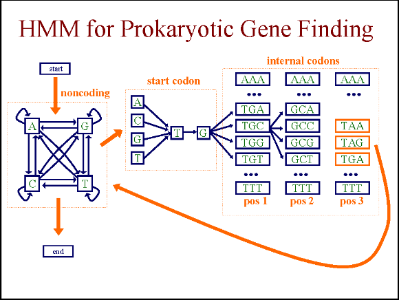

# Bioinformatics Homework 4 [CSCI 4800]

## Hidden Markov Model for Gene Finding
You are to implement a hidden Markov model for gene finding and apply it to E. colidata

### The Model
Your HMM should have the architecture shown inthe below figure. This model has three groups of states plus a silent start state and a silent end state. The three groups of states are intended to represent noncoding sequences, start codons, and internal codons (i.e. codons in genes excluding the start codons), respectively.



### Training
The training data for estimating the parameters of your model the strain of E. Coli. The file sequenceOfEcoliStrainM54.txtcontains the complete sequence of the main laboratory strain of *E. coli. When reading in this file, be sure to discard any whitespace characters.*

The file train.seqscontains a list of 100 subsequences that you should use for training. Each line in this file describes a single sequence. The first and second columns list the start and end coordinates for the sequence, respectively. These values can be used to extract the actual sequence from the sequence file. For example,the coordinates of the first sequence are [1, 2800]. This means that the first training sequence comprises the first 2800 characters of the E. coli sequence. Note that the index of the first character in the sequence file is 1, not 0. The subsequent columns list the coordinates of the genes contained in each sequence. Each gene is described by a pair of coordinates inside of brackets. For example, the firstsequence contains two genes, one that extends from the 190th position of the genome sequence to the 255th position, and one which extends from position 337 to position 2799.

All of the sequences in train.seqs start and end with noncoding sequences and have noncoding sequences interspersed between their genes. Moreover, all of the genes are on the given strand.

You won't need to use the Forward-Backward (Baum-Welch) algorithm for training, since for each of the training sequences it is clear which state "explains" each base. Instead training will consist of counting transition frequencies in the training set and converting these into probabilities. *You should use a pseudocount value = 1 for each of the transitions.*

### Testing
To use your model to predict genes in new sequences, you should implement the Viterbi algorithm. Given a test sequence, use the Viterbi algorithm to predict the sequence coordinates of any genes in the sequence. In particular, for each predicted gene, you should report the coordinate of the first base in the start codon and the last base in the stop codon. 

You should test your model using the sequences intest.seqs. The format of this file is the same as the format of train.seqs.

For each test sequence, your program should outpu the coordinates of the sequence, and the coordinates of each predicted gene in the test sequence. Here is the output that you program should produce for the test file provided, assuming you HMM was trained on the training file provided:

```
727956-728805: [728357, 728563]
732815-733442: No gene
735443-738223: [736450, 737184] [737333, 738076]
793868-794311: [793996, 794145]
797655-798844: [797809, 798804]
799862-805220: [800003, 801034] [801173, 802543] [802726, 804987]
812171-814961: [812749, 814770]
815871-817792: [816267, 817256] [817278, 817790]
```

__Your output should be in exactly this format.__ To verify the correctness of your program we will run it on additional training/test sets.

Hint: When implementing the Viterbi algorithm, instead of multiplying probabilities, you should sum log-probability values. This avoids underflow problems and also improves the resolution of computed values.

### What to turn in
1. You should turn in yoursource code andexecutables/byte codes electronically.
1. MS word file: Describe what you didfor the homework assignment. 
1. In addition, turn in
    * a file listing the indices used for the states.
    * a file listing the transition counts you get for the provided training set.